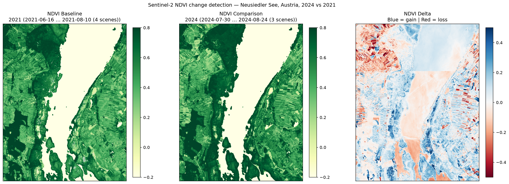

# Sentinel-2 Satellite Change Detection

[](https://github.com/lubna-ishaq/satellite-change-detection/actions/workflows/tests.yml)



A geospatial pipeline and web app that detect land-cover change between two
seasons using ESA Sentinel-2 L2A imagery from the Microsoft Planetary
Computer. Three spectral indices are supported — vegetation, open water and
burn severity — and results can be exported as a georeferenced GeoTIFF.

The figure above is reproducible from this repository:

```bash
python main.py --baseline-year 2021 --comparison-year 2024 \
    --aoi "Neusiedler See, Austria" --max-scenes 4
```

## Quickstart

```bash
git clone https://github.com/lubna-ishaq/satellite-change-detection.git
cd satellite-change-detection

python -m venv venv && source venv/bin/activate   # Windows: venv\Scripts\activate
pip install -r requirements.txt

streamlit run app.py        # interactive dashboard
python main.py --help       # command line pipeline
python validation.py --list # documented test cases
```

No credentials are needed: the Planetary Computer STAC catalogue is public
and asset URLs are signed anonymously by `planetary-computer`.

## Deploying the app

The repository is ready for [Streamlit Community
Cloud](https://share.streamlit.io) — free, and no configuration beyond what
is already committed:

1. Push this repository to your GitHub account.
2. On Streamlit Community Cloud choose **New app**, pick the repository,
   and set the main file to `app.py`.
3. Deploy. `requirements.txt` is the build manifest and
   `.streamlit/config.toml` supplies the theme.

`rasterio` and `pyproj` ship manylinux wheels with GDAL and PROJ bundled, so
no `packages.txt` and no system libraries are required.

Hosted instances are memory-limited, which is why `data_access.MAX_PIXELS`
caps a request at 40 megapixels. A larger area is refused with a message
suggesting a coarser resolution rather than being killed by the platform.

## Spectral indices

Every index is a normalised difference `(a − b) / (a + b)` over two bands.

| Index | Bands | Measures | Negative delta means |
| --- | --- | --- | --- |
| `NDVI` | B08 (NIR), B04 (Red) | Vegetation vigour | Vegetation loss |
| `NDWI` | B03 (Green), B08 (NIR) | Open water extent | Water loss, drying |
| `NBR` | B08 (NIR), B12 (SWIR 2) | Burn severity, recovery | Burn, vegetation loss |

Values run from −1 to +1. For NDVI, water and snow are negative, bare soil
and urban surfaces sit near 0, and a dense canopy reaches +0.4 to +0.8.

Note the NBR sign convention: this pipeline always reports **comparison
minus baseline**, so a fire shows up as a *negative* delta. The `dNBR`
convention in the literature is the reverse.

## Method

### 1. Scene selection

Both seasons are queried over the same bounding box and season window with
a scene-level cloud filter. Candidates are **sorted by `eo:cloud_cover`**
and the cleanest few are kept, rather than taking whichever scene the API
happens to return first.

The scene budget (`--max-scenes`) is applied **per MGRS tile**, not per
request. An area wider than ~110 km spans several Sentinel-2 tiles, and a
single global sort by cloud cover can return N scenes that all belong to
the same tile — leaving the rest of the area with no observations, silently
masked away as no-data. That failure is easy to miss because the output
still looks plausible; it shows up as a low valid-pixel fraction and, where
two tiles meet, as a straight-edged seam in the delta.

### 2. Radiometric harmonisation

From ESA **Processing Baseline 04.00** (acquisitions on or after
2022-01-25), L2A bottom-of-atmosphere reflectance is stored with an
additive offset of **−1000 DN**. A normalised difference is a ratio, so the
offset does not cancel out: comparing a 2021 baseline against a 2024 target
without correcting it produces a large, spatially coherent bias across the
whole scene that looks exactly like real land-cover change. Every scene is
converted to reflectance with the offset appropriate to its acquisition
date before any index is computed.

### 3. Per-pixel cloud masking

A scene-level `eo:cloud_cover < 10 %` filter says nothing about an
individual pixel. Cloud (SCL 8, 9), thin cirrus (10), cloud shadow (3),
snow (11), saturated (1), dark area (2) and no-data (0) pixels are masked
out via the **Scene Classification Layer**. Water (SCL 6) is deliberately
kept — shrinking lakes are one of the changes this pipeline is meant to
surface.

### 4. Shared analysis grid

Two Sentinel-2 scenes from different years can come from different orbits
and tiles, on different native grids. Both seasons are therefore loaded
onto **one deterministic `GeoBox`** in the UTM zone of the area of interest
(see `data_access.build_geobox`), so the delta compares identical ground
locations pixel for pixel. `calculate_index_delta` raises rather than
broadcasting if that invariant is ever violated.

Metric resolution is applied in UTM rather than Web Mercator on purpose: in
EPSG:3857 a nominal 20 m pixel covers roughly 13.6 m on the ground at 47° N.

### 5. Median compositing

Instead of a single acquisition date — which largely measures that day's
weather and sun angle — the index is computed per scene and reduced with a
**NaN-aware median** across the season window.

### 6. No-data discipline

Invalid pixels are carried as `NaN`, never as `0`. Zero is a legitimate
index value for bare soil, so using it as a no-data flag would silently
contaminate every mean, histogram and change count. Masked pixels are drawn
in neutral grey so cloud gaps are never mistaken for "no change".

### 7. Per-pixel confidence

Two things travel with every composite: how many scenes actually reached
each pixel, and how much those scenes disagreed. Both matter and neither is
visible in the composite itself — a pixel built from one observation looks
exactly like one built from six.

The observation count ships as the second band of the GeoTIFF, and pixels
resting on a single scene are called out in the CLI and the app.

The scatter feeds `--adaptive-threshold`, which replaces the fixed ±0.1
with a per-pixel bar of `sigma × scatter`, floored. A single constant is
wrong in both directions at once: over noisy bare ground it lets scatter
through as change, and over a stable canopy it hides real change smaller
than the constant. Pixels with too few observations to estimate scatter get
the scene's *typical* threshold, never the floor — otherwise the least
observed pixels would get the easiest bar, which is exactly backwards.

### 8. Seasonal offset

A mid-June composite compared against a late-August one measures the
growing season as much as it measures change. The mean day-of-year of each
composite is reported, and a gap beyond three weeks raises a warning.

### 9. Quantitative output

`ndvi_core.change_statistics` reports the share of the **valid** area that
increased or decreased beyond a configurable threshold, plus mean and
median delta and the fraction of the raster that survived masking.

## Validation

Unit tests prove the arithmetic is self-consistent. They cannot prove the
pipeline detects real change on real imagery, so `validation.py` runs the
whole pipeline against places and periods where something documented
happened and checks the direction and rough magnitude of the result:

```bash
python validation.py             # all cases
python validation.py --list      # what each case is and why
python validation.py --case camp-fire
```

### Measured results

All five cases pass. Reproduce with `python validation.py`:

| Case | Index | Period | Result |
| --- | --- | --- | --- |
| Camp Fire burn scar, Paradise CA | NBR | 2018 → 2019 | **66.3 %** decreased (needs ≥ 25 %), mean delta −0.251 |
| Camp Fire regrowth, same box | NBR | 2019 → 2024 | **51.0 %** increased (needs ≥ 25 %), mean delta +0.144 |
| Kakhovka reservoir, Ukraine | NDWI | 2022 → 2024 | **93.0 %** of 2022 water is gone (needs ≥ 50 %), mean delta −0.711 |
| Eastern basin, South Aral Sea | NDWI | 2018 → 2024 | **98.6 %** of 2018 water is gone (needs ≥ 40 %), mean delta −0.695 |
| Negative control, Great Sand Sea | NDVI | 2019 → 2024 | mean bias **0.0065** (≤ 0.020), **0.0 %** scattered (≤ 2 %) |

The margins matter more than the pass marks. The water cases clear their
thresholds by 40 points and more, and the control comes back completely
quiet — not "quiet enough", but zero pixels crossing the change threshold
across 235 000 pixels of desert.

The two Camp Fire rows share one bounding box and disagree in direction by
construction: the same ground must fall after the fire and recover five
seasons later. A sign error, a swapped baseline or a broken harmonisation
cannot satisfy both.

### What the control is for

A hyper-arid stretch of the Sahara, where essentially nothing changes
between years, is the most informative case in the set: a pipeline with a
residual calibration bias will happily report "change" there. The control
is judged on the **mean** delta, not on the share of pixels that moved.
That is deliberate — over near-zero NDVI a ratio of two small reflectances
is noisy, so a few percent of pixels cross any per-pixel threshold without
anything having happened, while a calibration error shifts the whole scene
and shows up in the mean. A drift of 0.05 — invisible to a ±0.1 per-pixel
rule, because no single pixel crosses it — fails this control.

### How the cases are scored

Events are scored over the ground they affect, not over the whole box. A
draining reservoir changes the water, not the surrounding farmland, so
"share of the whole box that lost water" mostly measures how much padding
the bounding box has: pad it more and the same real event scores lower.
Water cases therefore restrict scoring to pixels that were water in the
baseline (`baseline_above`). Coverage is still checked on the full raster,
so missing imagery cannot hide behind a restricted score.

### Reading these numbers honestly

Criteria in this suite were revised **after** seeing real results — three
times. That is the mechanism by which a test suite gets quietly fitted to
the answer it already produced, so the revisions are listed here rather
than buried in git history, and a reader should judge them individually:

1. **Whole-box → baseline-region scoring** for the water cases. The old
   metric mostly measured how much padding a bounding box had; pad it more
   and the same real event scored lower. The threshold went **up**, 20 % →
   50 %.
2. **Scatter → mean bias** for the control. A calibration error shifts a
   whole scene and shows in the mean; a drift of 0.05 crosses no per-pixel
   ±0.1 rule at all and the old criterion could not see it. The new one
   fails it, and `tests/test_validation.py` pins that.
3. **Scatter bound 15 % → 2 %** for the control, after the site moved. This
   one is a correction, not a refinement: the 15 % was derived from 7.7 %
   scatter at a location that turned out to be an irrigation scheme, and
   explained away as desert noise. On real dune field the figure is 0.0 %,
   so the original reasoning was simply wrong and its conclusion had to go
   with it.

Every revision moved a threshold in the strict direction, each fixed an
identified defect in *what was measured* rather than a number someone
disliked, and each is pinned by a unit test that the previous version would
have failed. That is the standard any further change should meet: argued
from a defect in the metric, before the run, not after.

### Both directions

A suite that only ever tests decreases proves less than it looks. The
regrowth case reuses the Camp Fire bounding box unchanged and asks for the
opposite result five growing seasons later, so a sign error or a swapped
baseline cannot pass both.

### Checking the boxes

Every box has been inspected on a map against what it is meant to contain.
This is not bookkeeping. The negative control originally sat at
28.40–28.70 E / 22.60–22.85 N — which reads as empty desert on a satellite
image but is the East Uweinat centre-pivot irrigation scheme, airport
included. A control standing on active farmland cannot separate pipeline
bias from real cropping change, which is its only job. It now sits in open
dune field in the Great Sand Sea.

### Caveats

Boxes are still approximate — chosen to contain the event, not to trace it
— so re-check before citing any number. The Aral Sea case needs a larger
imagery budget than the others (`max_cloud=40`, 6 scenes per tile): scene
availability over that region, not the surface, is the limit.

## Exporting results

`--geotiff PATH` (CLI) and the **Download delta (GeoTIFF)** button (app)
write a single-band float32 raster carrying the CRS, affine transform, NaN
nodata and provenance tags — ready for QGIS, ArcGIS or `rasterio`:

```bash
python main.py --index NBR --bbox -121.70 39.68 -121.50 39.86 \
    --baseline-year 2018 --comparison-year 2019 \
    --geotiff camp_fire_nbr.tif
```

## CLI options

| Flag | Default | Meaning |
| --- | --- | --- |
| `--baseline-year` | `2021` | Reference season. |
| `--comparison-year` | `2024` | Target season. |
| `--index` | `NDVI` | `NDVI`, `NDWI` or `NBR`. |
| `--season` | `06-01:08-31` | Season window `MM-DD:MM-DD`, applied to both years. |
| `--aoi` | `Graz, Austria` | Named preset (see `data_access.AOI_PRESETS`). |
| `--bbox W S E N` | — | Custom bounding box in EPSG:4326, overrides `--aoi`. |
| `--resolution` | `20` | Output pixel size in metres. |
| `--max-cloud` | `10` | Scene-level cloud cover ceiling in percent. |
| `--max-scenes` | `6` | Scenes per year to composite; `1` disables compositing. |
| `--threshold` | `0.1` | Index magnitude below which a change counts as noise. |
| `--adaptive-threshold` | off | Judge each pixel against its own scatter instead of one constant. |
| `--sigma` | `2.0` | Multiples of per-pixel scatter required when adaptive. |
| `--threshold-floor` | `0.05` | Smallest per-pixel threshold allowed when adaptive. |
| `--out` | `change_detection_vergleich.png` | Output figure. |
| `--geotiff` | — | Also write the delta as a GeoTIFF. |

## Limitations

* Normalised indices saturate: over dense canopy, large biomass differences
  register as small NDVI deltas.
* Sun-angle and phenology differences between seasons remain even after
  compositing — a shifted harvest date can look like vegetation loss.
  **Interpret a single-season delta as a candidate for change, not
  confirmed change.**
* No topographic or BRDF correction, so steep terrain retains an
  illumination bias.
* SCL is imperfect; thin cloud edges and cloud shadow over water are its
  known weak spots.
* The default season window is northern-hemisphere summer. Use `--season`
  for southern-hemisphere or dry-season analysis.
* Place-name search uses OpenStreetMap Nominatim, whose usage policy allows
  interactive lookups only — not bulk geocoding.

## Project structure

```text
.
├── ndvi_core.py       # Index registry, harmonisation, masking, delta, statistics
├── data_access.py     # STAC search, shared GeoBox, cloud-masked composites
├── plotting.py        # Shared figure construction for both front ends
├── export.py          # GeoTIFF writer (file and in-memory)
├── geocoding.py       # Place-name search via Nominatim
├── validation.py      # Documented change events + negative control
├── main.py            # Command line pipeline
├── app.py             # Streamlit dashboard
├── tests/             # 110 unit tests, no network required
├── .streamlit/        # Theme and server settings for deployment
├── .github/workflows/ # CI: ruff lint + format check, pytest with coverage gate
├── pyproject.toml     # pytest, coverage and ruff configuration
├── requirements.txt   # Runtime deps, also the deployment manifest
└── requirements-dev.txt
```

## Development

```bash
pip install -r requirements-dev.txt
ruff check . && ruff format --check .
pytest --cov --cov-report=term-missing
```

The test suite is offline: STAC responses, imagery and geocoding are all
stubbed, so `pytest` needs no network and no credentials. `validation.py`
is the only part that reaches the internet, and it is deliberately kept out
of CI.

## Technical stack

Python 3.11+ · numpy · rasterio · odc-stac · odc-geo · pystac-client ·
planetary-computer · matplotlib · streamlit · folium

## License

MIT — see [LICENSE](LICENSE).
